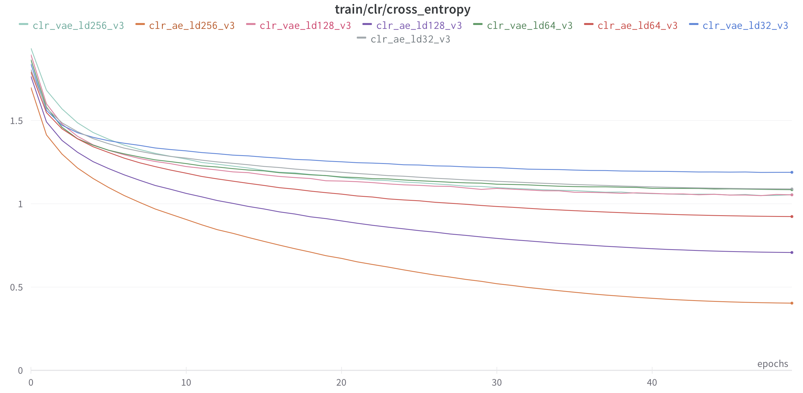
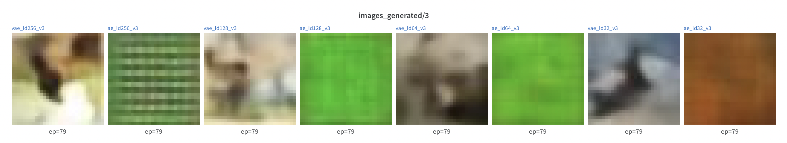

# Embeddings classifier

## Installation
1. Clone repository with submodules:
```bash
git clone --recurse-submodules git@github.com:NikolayKozyrskiy/embed_classifier
```
2. Go to the root dir of the project:
```shell
cd embed_classifier
```
3. Run script `scripts/create_env.sh` to create new conda environment named `emb_clsr`, activate it and install all needed dependencies:
```bash
source scripts/create_env.sh
```

[CIFAR10](https://www.cs.toronto.edu/~kriz/cifar.html) dataset will be downloaded on demand automatically.

## Structure of the project
* The architecture of the autoencoder and classifier are in `classifier/models/*`.
* The pipeline with autoencoder and classifier functions is `classifier/pipeline.py`.
* Losses and metrics are implemented and processed in `classifier/output_dispatcher.py`.
* Main train and validation functions are in `classifier/train.py`.
* Configs are organized as python objects powered by `BaseModel` from `pydantic` package. The main config is implemented in `classifier/config.py`. The particular configs for various experiments are in `classifier/configs/*`
* The data is stored in dir `_data` (created automatically on demand).
* The training logs are in `logs`(created automatically on demand).
* Some useful bash scripts for running experiments are in `scripts/*`.

## Training and validation
All scripts must be run from the project root.
To reproduce the latest results run script:
```bash
sh scripts/train_ae_and_vae.sh
```
After the script finishes, to train classifiers run:
```bash
sh scripts/train_classifier.sh
```
To validate the trained models use the following scripts for autoencoder and classifier correspondingly:
```bash
sh scripts/eval_ae.sh
sh scripts/eval_classifier.sh
```
You need to change the `config_path`, `logdir` and `checkpoint` values in these scripts according to your onw ones. The attached scripts can treated as examples.
 

For baseline architectures I took ligh-weigth neural networks for fast training.
[wandb](https://wandb.ai) is used to log results. On the first run you will be asked your authorization token if wandb is not initialized on your machine.
All training and validation loss and metrics values are logged locally and sent to wandb. During training procedure of autoencoder the gt, reconstructed and sampled images are logged to wandb. 

I also use the wandb functionality to vizualize the embeddings. On the project page on wandb one can choose the dimentionality reduction method on the corresponding panel. Among the available methods are PCA, t-SNE and UMAP. The visualization is only possible in 2-dimensions, i.e. plain image. According to the obtained visualizations the embeddings can't be classified well in 2-dimensional case even with non-linear reduction methods like t-SNE and UMAP.


## Baseline
I used the light-weight vanilla encoder and decoder modules with different latent space size. A small MLP with 1 hidden layer is used as classifier. I trained autoencoders and classifiers on embeddings with 32, 64, 128 and 256 latent space sizes. All autoencoders converged quite fast without overfitting. I used cosine annealing learning rate scheduler without restarts. To monitor quality of the reconstructed images I used PSNR. I don't add the reconstructed examples here as it's already obvious that with PSNR value in range 20-26 the reconstructed images are meaningfull and quite simialar to original ones. Moreover, they are in extremely low resolution 32x32 so that reconstruction artifacts are smoothed strongly. According to the obtained results the smallest reconstruction error is acheived with the biggest latent space size, no surprizes here:


The classifiers were trained on the embeddings produced by trained autoencoders:


One can see that the best performance is achieved by classifier trained on embeddings of size 256, and it converges very fast. However it also overfits rapidly after reaching local minimum of CE. This means that more strict regularizations are needed, including reconsideration of architecture.
The classifier trained on embeddings of size 128 can't achieve the same quality but also overfits quite fast. According to the obtained results the embeddings of size 32 don't contain enough information neither for precise reconstruction nor for classification, so 32 is too low dimensionality for latent space in this setup. Finally, the classifier trained on the embeddings of size 64 don't overfit and achieve highest scores by the end of training procedure. Its performance is slightly lower than classifier-256's one in its CE local minimum. However classifier-64 is more stable in this setup. In general, the samples from CIFAR10 dataset have shapes `32x32x3 = 3072` and represent 10 different classes of objects from the wild world. The compression ratio in case of latent space of size 64 will be `3072 / 64 = 48` which seems reasonable for classification task on image embeddings. As a simple autoencoder is trained on basic MSE loss without any regularizations and priors on the distributions, the constructed latent space is unstructed, that is why the reconstructed samples from standard Gaussian noise don't often represent the samples from the training dataset. The generated samples are logged during training procedure and can be viewed on wandb project page.


## Impleneted improvements

One of the straight-forward improvements is to use the Variational Autoencoder (VAE) as it is learnt in a way to construct the latent space of given samples with particular prior so that the obtained latent space will have a specific induced structure, if to be short. With such intuition one can try to train classifier on the obtained embeddings of given samples which now have meaningful place in latent space. Moreover, if trained correctly and VAE didn't collapse, the VAE decoder can generate quite similar images to the ones from the dataset using samples from prior distribution (standard Normal in my experiments). I ran the same experiments as for the baseline vanilla autoencoder with almost the same simple architectures of encoder and decoders. For reconstruction loss I used simple MSE, though it might be not the best choice.


The reconstruction MSE loss values are lower for the corresponding pairs of AEs and VAEs as VAEs have explicit regularization on the structure of latent space by KLD loss, which makes reconstruction slightly worse than without KLD.

The classifiers trained on embeddings of VAEs converge stably for all latent space dimentionalities. Their performance is generally better than the corresponding pairs for basic AE. Moreover, classifiers trained on embeddings of sizes 64, 128 and 256 perform rather simillar by the end of the training procedure. Thus in such case 64 or 128 are good candidates for latent space size.




The image below demonstrates the generative ability of different autoencoders:



As one can see, all basic autoencoders can't generate meaningfull results from vector sampled from standard Normal distribution. At that time VAEs are able to generate close images to the ones from dataset in some sense. A good illustration is for VAE with 64 latent space size where one can see the image close to a dog. The VAE with latent space of size 256 produced a clear image of a bird. These images are randomly chosen and are not cherry-picked.

## Other possible improvements

One direction of improvement is to use more powerful and efficient Encoder and Decoder architectures which can extract better features from dataset images in order to be able to construct a better latent space. Ecoder and Decoder with Resnet18 backbones are implemented in the project as examples.

The main idea is to organize the latent space in such a way that the emdebbings of different samples can be easily separated preserving the reconstruction ability of autoencoder.

Another possible approach to improve classifier performance is add the Cross-Entropy loss in training VAE which will introduce another corresponding restrictions on the latent space construction.

One more possible regularizations on the latent space can be the something like anti-correlation loss, which will force the embeddings of samples of different classes to be uncorrelated or in the best case orthogonal. Such embeddings should be easily classified even by classical ML algorithms.
